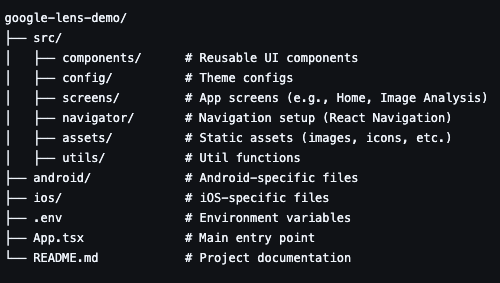

# Google Lens Clone

A feature-rich **React Native application** that replicates the core functionality of **Google Lens**, allowing users to analyze images, perform text recognition (OCR), and access visual search results. This app also includes **social authentication** for seamless user login and management.

## Tech Stack

- **Frontend**: React Native, TypeScript
- **Backend**: Firebase (for authentication )
- **APIs**: Google Search API

---

## Prerequisites

Before you get started, ensure you have the following installed:

- [Node.js](https://nodejs.org/) (v16 or higher recommended)
- [Yarn](https://yarnpkg.com/) or npm
- [Android Studio](https://developer.android.com/studio) and/or Xcode (for running the app on emulators or devices)
- Firebase project set up for social authentication and cloud storage

---

## Getting Started

### 1. Clone the Repository
```bash
git clone https://github.com/yourusername/google-lens-clone.git
cd google-lens-clone
```


### 2. Install Dependencies
```bash
npm install
```

### 3. Configure Firebase
- Set up a Firebase project and enable Authentication (Google).
- Enable Firebase Storage for image uploads.
- Add your google-services.json (for Android) and GoogleService-Info.plist (for iOS) in their respective directories.

### 4. Run the application
```bash
npm run android
```


## Project Structure



